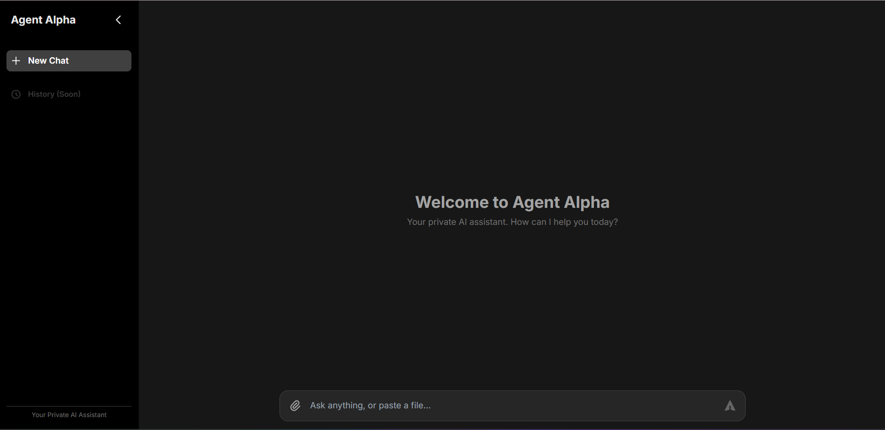
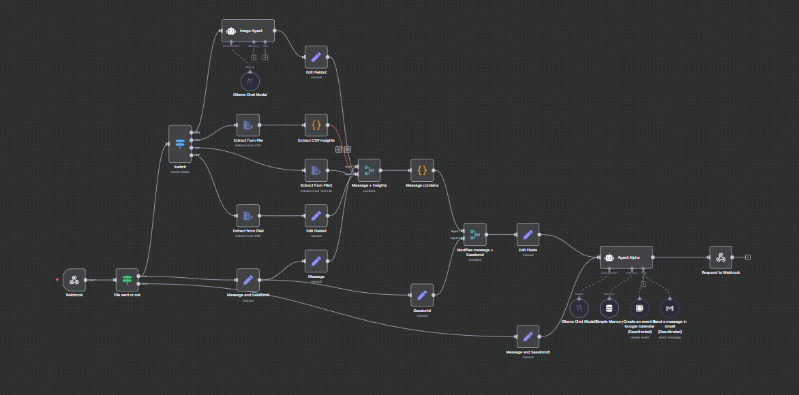

# Agent Alpha: Your Private, Locally-Hosted AI Assistant

## 1. Project Overview

Agent Alpha is a robust, private, and locally-hosted AI automation platform. It's designed to give you full control over your data and AI models, running entirely on your own machine. By integrating powerful open-source tools, Agent Alpha provides a versatile and secure environment for creating sophisticated AI-driven workflows.

This project leverages `docker-compose` to seamlessly orchestrate three core services:

*   **Ollama**: For running and managing large language models (LLMs) locally. This allows you to use state-of-the-art AI for text generation, analysis, and more, without relying on external cloud providers.
*   **n8n**: A powerful workflow automation tool. It acts as the "brain" of the operation, connecting the user interface, AI models, and other services to execute complex, automated tasks.
*   **PostgreSQL**: A reliable and scalable relational database that serves as the persistent data store for n8n, ensuring your workflow data and configurations are securely managed.

The platform includes a user-friendly chat interface, allowing you to interact with the AI, ask questions, and process files, making it a comprehensive solution for personal or business automation.

## 2. Features

*   **Local First, Privacy Focused**: All services run locally, ensuring your data remains private and secure.
*   **Versatile File Processing**: The default workflow can analyze and extract content from **PDF**, **TXT**, **CSV**, and **JPG** image files.
*   **Extensible Automation**: N8n's visual workflow editor allows for easy customization and integration with hundreds of other applications and services.
*   **GPU Acceleration**: Supports NVIDIA GPUs for accelerated LLM inference, providing faster response times.
*   **Cloud Model Integration**: Flexibility to connect to powerful cloud-based models like **Google's Vertex AI / Gemini API** as an alternative to running models locally.
*   **Pre-configured Chat UI**: A clean, modern chat interface is ready to use out of the box.

## Screenshots

### Agent Alpha Interface


### n8n Workflow Diagram


## 3. System Requirements

To ensure a smooth experience, please make sure your system meets the following requirements:

*   **Operating System**: Windows, macOS, or Linux.
*   **Docker**: Docker and Docker Compose must be installed.
    *   [Install Docker](https://docs.docker.com/get-docker/)
*   **Hardware**:
    *   **CPU**: A modern multi-core processor.
    *   **Memory (RAM)**: A minimum of **16 GB** is recommended, especially for running larger language models.
    *   **GPU**: An **NVIDIA GPU** with at least **8 GB of VRAM** is highly recommended for acceptable performance with local LLMs. The system will fall back to CPU if a GPU is not available, but performance will be significantly slower.
*   **Python**: Python 3.8 or newer.

## 4. Step-by-Step Installation and Setup

Follow these instructions carefully to get Agent Alpha up and running.

### Step 1: Clone the Repository

Open your terminal or command prompt and clone this repository to your local machine.

```bash
git clone https://github.com/your-username/Agent-Alpha.git
cd Agent-Alpha
```
*(Note: Replace the URL with the actual repository URL if you forked it.)*

### Step 2: Install Python Dependencies

This project includes a Flask web application that serves the chat interface. Install the required Python libraries using pip.

```bash
pip install -r requirements.txt
```

### Step 3: Start Core Services with Docker

The `docker-compose.yml` file is configured to start all necessary services.

```bash
docker-compose up -d
```
This command will download the necessary images and start the Ollama, n8n, and PostgreSQL containers in detached mode (`-d`).

### Step 4: Pull Local AI Models

Once the `ollama` container is running, you need to pull the language models that the agent will use.

Execute the following commands in your terminal:

```bash
# Pull Llama 3.1 (for general chat and reasoning)
docker exec -it ollama ollama pull llama3.1:latest

# Pull Gemma 3 (can be used for various tasks)
docker exec -it ollama ollama pull gemma3:latest
```
*Note: The download size for these models is several gigabytes. This step may take some time depending on your internet connection.*

### Step 5: Verify and Configure the n8n Workflow

The heart of Agent Alpha is the pre-built n8n workflow.

1.  **Access n8n**: Open your web browser and navigate to `http://localhost:5678`.
2.  **Log In**: Use the default credentials from the `docker-compose.yml` file:
    *   **User**: `admin`
    *   **Password**: `yourpassword`
    *(It is highly recommended to change these credentials for security.)*

3.  **Check for the Workflow**: Upon logging in, you should see the **"Agent_Alpha"** workflow on your dashboard.

4.  **(Optional) Import the Workflow**: If the workflow is not present, you can import it manually:
    *   Click on "New" to create a new workflow.
    *   In the new workflow canvas, go to **File > Import from File**.
    *   Select the `Agent_Alpha.json` file located in the `n8n` folder of this project.

### Step 6: Connect the Chat UI to n8n
The Python-based chat interface needs to know how to communicate with the n8n workflow. This is done via a unique webhook URL.

1.  **Open the "Agent_Alpha" workflow** in the n8n UI.
2.  Find the very first node, labeled **"Webhook"**. Click on it to open its settings.
3.  You will see a **"Webhook URLs"** section. Copy the **Production** URL. It should look something like `http://localhost:5678/webhook/93efbc4c-d97d-4e12-8dc5-a7dac6323f8f`.
4.  Open the `app.py` file in a code editor.
5.  Find the line `N8N_WEBHOOK_URL = "..."` and paste your copied Production URL into the quotes.
6.  Save the `app.py` file.

This ensures that when you send a message from the chat UI, it goes to the correct n8n workflow.

## 5. Using Agent Alpha

### Step 1: Launch the Chat Interface
The chat interface is a local web application. To start it, run the `app.py` file from the project's root directory.

```bash
python app.py
```
The application will start a local server. Open your web browser and navigate to the address shown in the terminal (usually `http://127.0.0.1:5000`).

### Step 2: Interact with the Agent
You can now start chatting!

*   **Text Chat**: Type a message and press Enter.
*   **File Analysis**: Attach a **PDF, TXT, CSV, or JPG** file. The agent will extract its content and you can ask questions about it. For example, you can ask it to "summarize this document" or "what are the main points in this image?".

## 6. Advanced Configuration

### Enabling Google Services (Gmail & Calendar)
The default workflow includes deactivated nodes for sending emails via Gmail and creating Google Calendar events. To use them, you must configure Google OAuth credentials.

1.  **Create Google OAuth 2.0 Credentials**:
    *   You will need to go to the [Google Cloud Console](https://console.cloud.google.com/) to create a new project and configure an OAuth 2.0 Client ID.
    *   This process involves setting up a consent screen and adding the correct redirect URI for n8n.
    *   For a detailed, step-by-step guide, we recommend watching this excellent YouTube tutorial:
        **[N8N Google OAuth Setup (NEW 2025): Step-by-Step Guide](https://www.youtube.com/watch?v=g_cW_3d-o-0)**

2.  **Add Credentials to n8n**:
    *   In your n8n dashboard, go to **Credentials > New**.
    *   Search for "Google OAuth2 API" and select it.
    *   Enter the **Client ID** and **Client Secret** you obtained from the Google Cloud Console.
    *   Follow the prompts to connect your Google account.

3.  **Activate the Nodes**:
    *   In the "Agent_Alpha" workflow, find the "Send a message in Gmail" and "Create an event in Google Calendar" nodes.
    *   Select your newly created credentials in the node settings.
    *   Activate the nodes.

### Using Cloud-Based LLMs (e.g., Google Vertex AI)
If you prefer not to run language models on your local machine, you can modify the n8n workflow to use powerful cloud-based models.

1.  **Get API Credentials**: Obtain an API key from your chosen provider (e.g., Google AI, OpenAI).
2.  **Add Credentials in n8n**: Store the API key securely in the n8n credentials vault.
3.  **Modify the Workflow**:
    *   Open the "Agent_Alpha" workflow in n8n.
    *   Delete the "Ollama Chat Model" nodes.
    *   Add a new node for your desired service (e.g., "Google Vertex AI" or "OpenAI Chat").
    *   Connect the new node in place of the old Ollama node and configure it with your prompt and credentials.

## 7. Troubleshooting

*   **Chat Messages Not Working**: If you send a message in the chat UI and nothing happens, the most likely cause is an incorrect webhook URL. Please follow **Step 6** of the **Installation and Setup** guide to ensure the URL in `app.py` matches the one in your n8n Webhook node.
*   **Port Conflicts**: If a service fails to start, it might be due to a port conflict. Check if ports `5000`, `5678`, `11434`, or `5432` are in use by other applications. You can modify the port mappings in `docker-compose.yml`.
*   **Ollama GPU Issues**: If Ollama isn't using your GPU, ensure your NVIDIA drivers are up-to-date and that you have the NVIDIA Container Toolkit installed for Docker.
*   **n8n Workflow Errors**: Check the execution logs in n8n for detailed error messages that can help diagnose issues with the workflow logic or credentials.

---

## 8. Hackathon and Contributors

This project was developed as part of the **NEXATHON 0.1** hackathon.

### Core Contributors

We extend our gratitude to the talented individuals who brought this project to life:

*   **Rohit Gomes**: [GitHub Profile](https://github.com/RohitXJ)
*   **Debmalya Panda**: [GitHub Profile](https://github.com/Debmalya727)
*   **Bidisha Pal**: [GitHub Profile](https://github.com/bi-disha)
*   **Sayanti Roy**: [GitHub Profile](https://github.com/Sayanti-Roy)